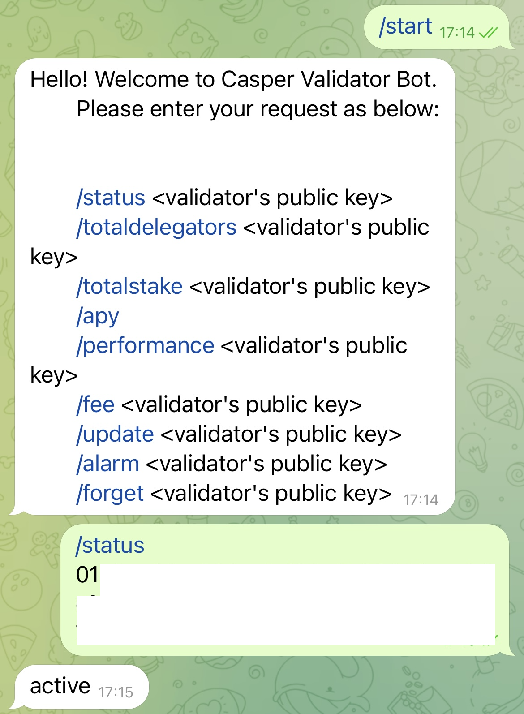
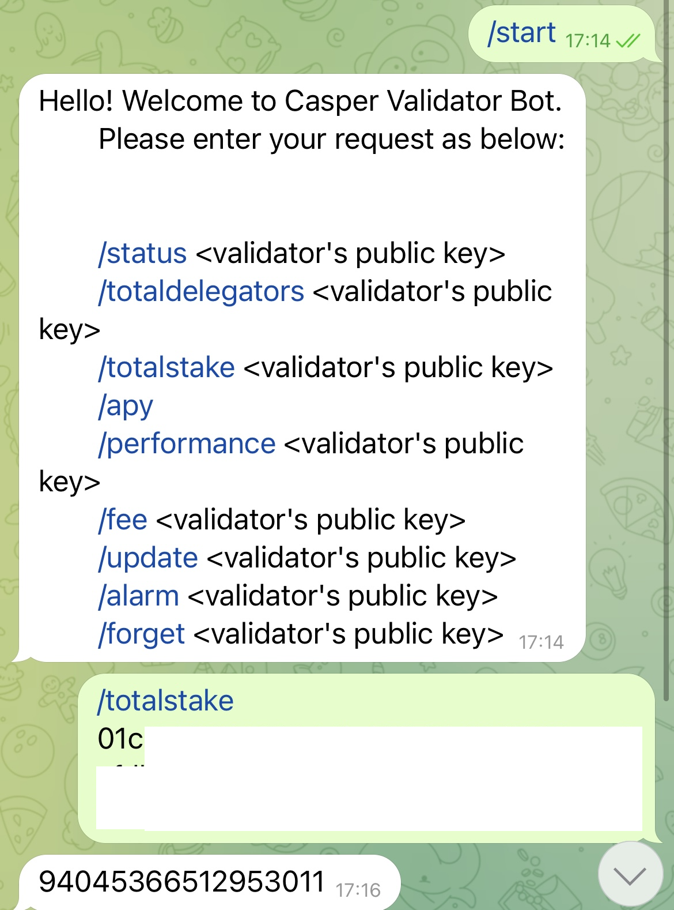
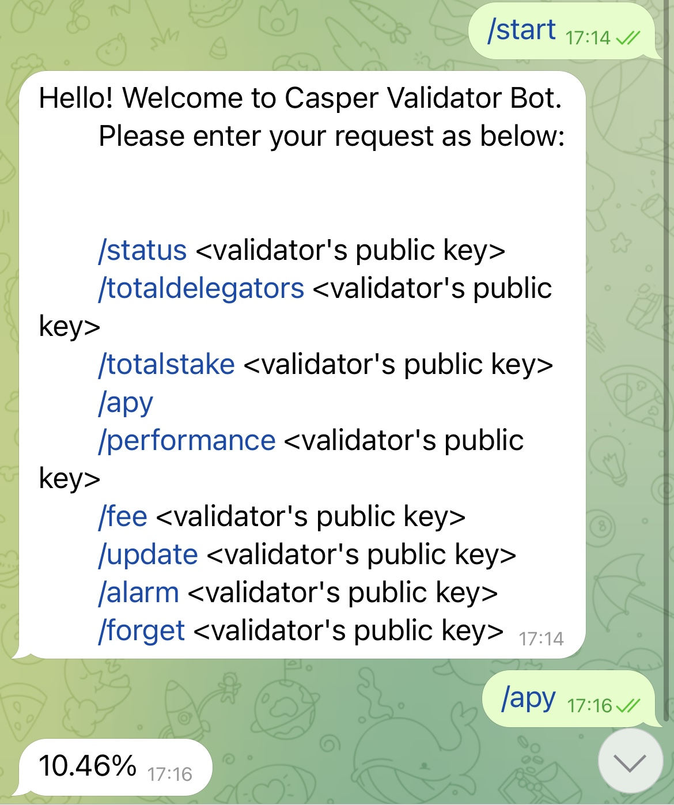
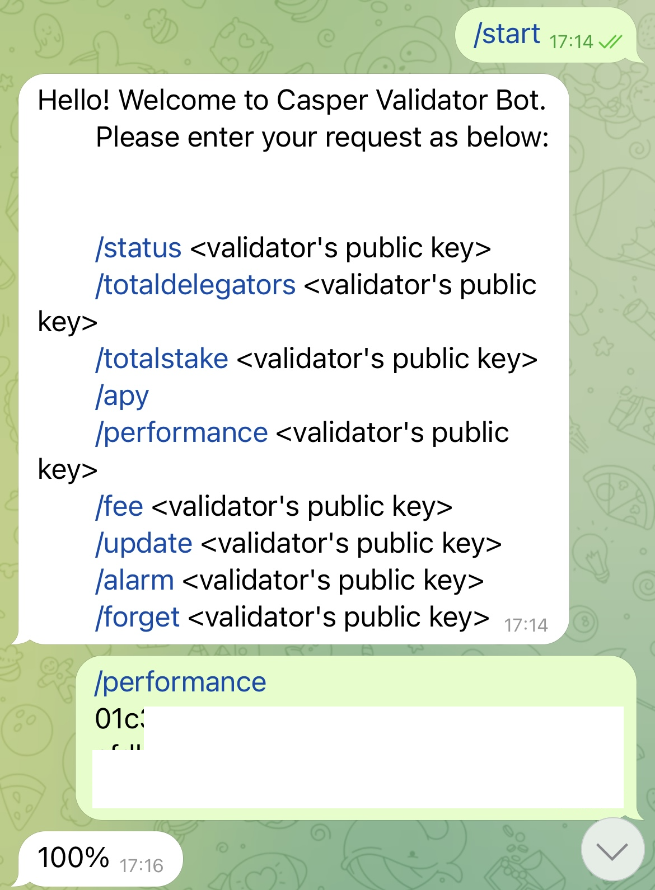
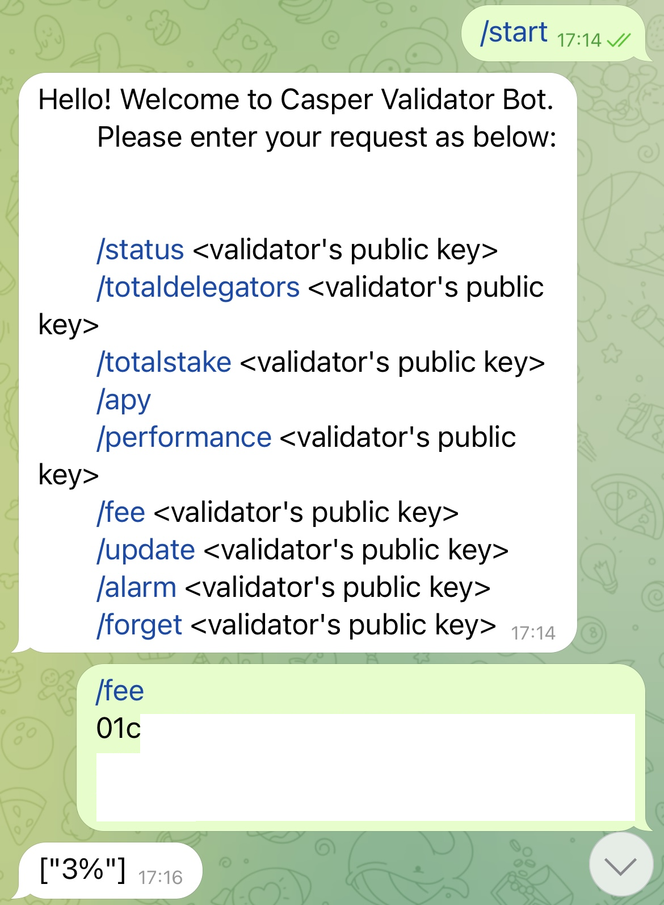
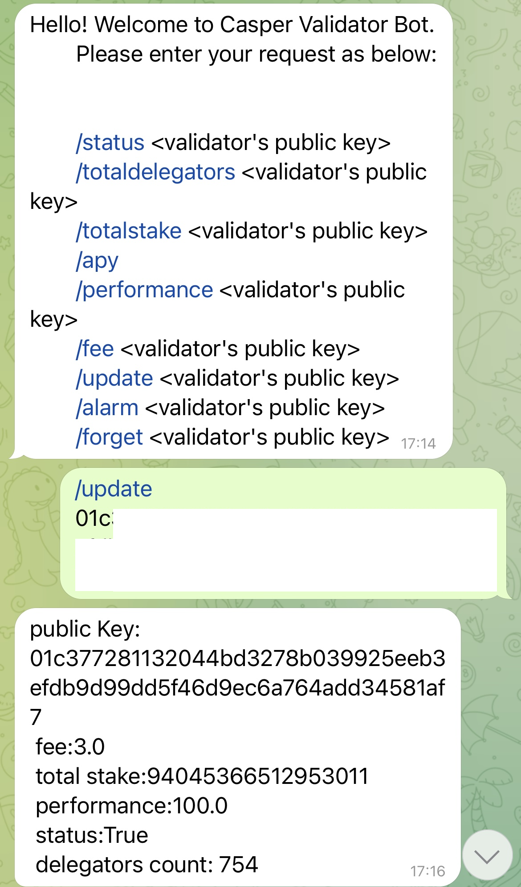
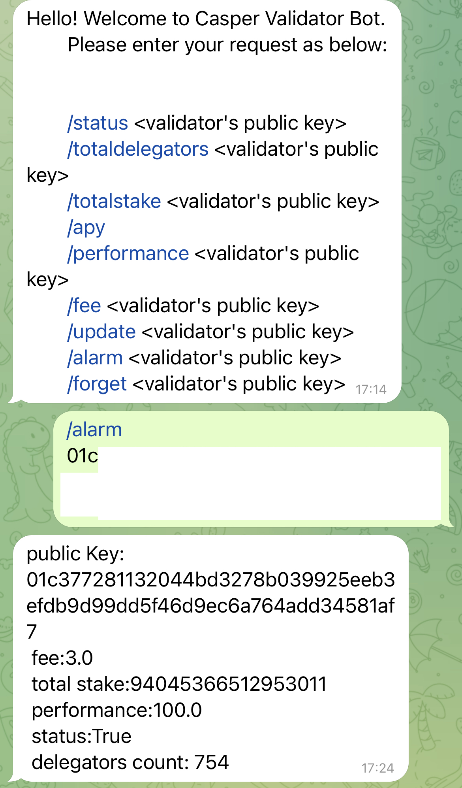
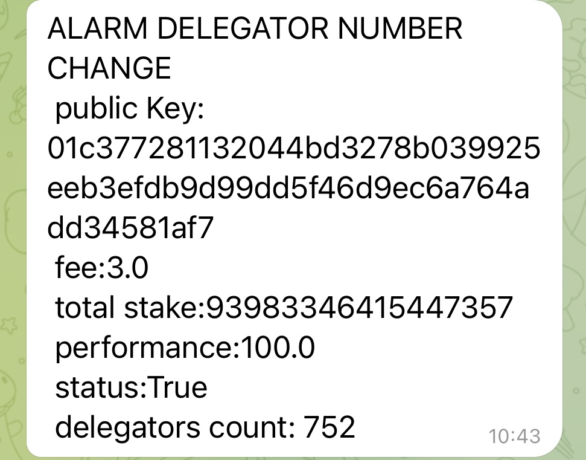
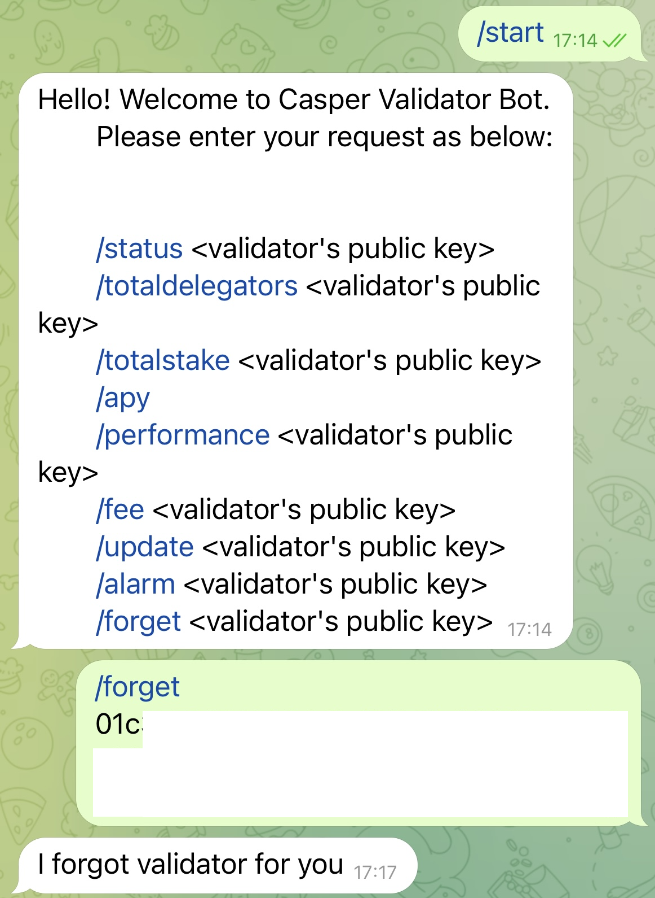

# Casper Validator Bot

Casper Validator Bot is a Telegram bot that provides information about active validators working on Casper Network.

### Prerequisites

Python3, pip and make packages should be installed on your system.

#### Install MongoDB

Download and run the mongo db server from official [website](https://www.mongodb.com/docs/manual/administration/install-community/).

Also, in the [Install DB File](assets/INSTALL%20DB.md) it is explained how to install and configure DB on MacOS as an example.

### How to set-up

1. Run [back-end](https://github.com/furkanahmetk/Casper-Bot-Optimized-API).

2. Clone the repository.
```
$ git clone https://github.com/furkanahmetk/telegram-validator-bot
```

3. Navigate to repository folder.
```
$ cd telegram-validator-bot
```
4. Create a `.env` file from the `example.env` template:

```shell
$ cp example.env .env
```

5. Create a new Telegram bot. See [how to](assets/telegram.md)

6. Copy your Telegram bot token to .env file.

7. Edit `src/config.pg`

``
Add your local URL and port to BASE_URL variable. It is set to 'http://localhost:5555/' by default.
``

8. Run MongoDB.

````shell
$ mongosh
````

### Run app

```shell
$ make run
```
### Run tests
```shell
$ make test
```

## Bot Usage

### Get status of a validator:

Send a message to bot:
```
/status <pubKey>
```


### Get total delegators of a validator:
Send a message to bot:
```
/totaldelegators <pubKey>
```


### Get total stake of a validator:

Send a message to bot:
```
/totalstake <pubKey>
```


### Get annual percentage yield(apy):

Send a message to bot:
```
/apy
```


### Get performance of a validator:
Send a message to bot:
```
/performance <pubKey>
```


### Get fee of a validator:
Send a message to bot:
```
/fee <pubKey>
```


### Get updates of a validator:
Send a message to bot to get latest information about a validator:
```
/update <pubKey>
```


### Turn on alarm
Send a message to bot to set an alarm that sends a message on any change:
```
/alarm <pubKey>
```




### Turn off an alarm
Send a message to bot to turn of an active alarm:
```
/forget <pubKey>
```


